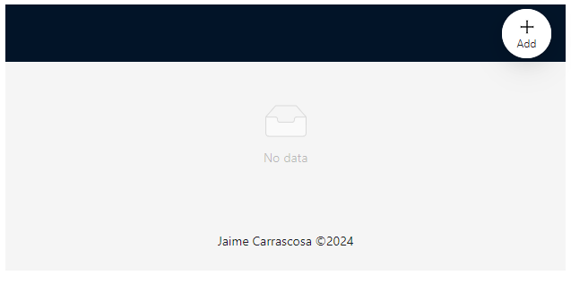
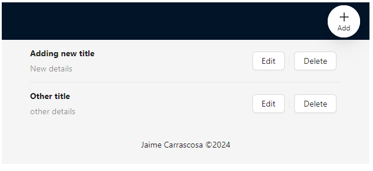
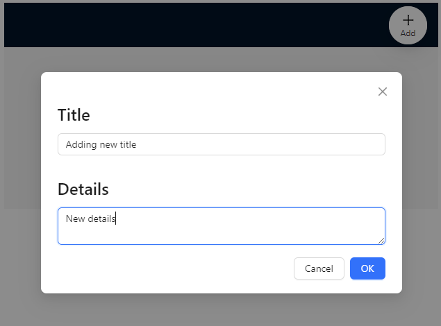
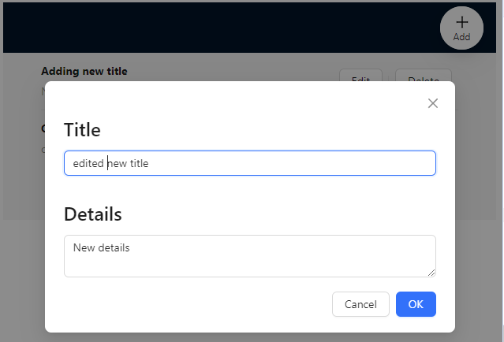
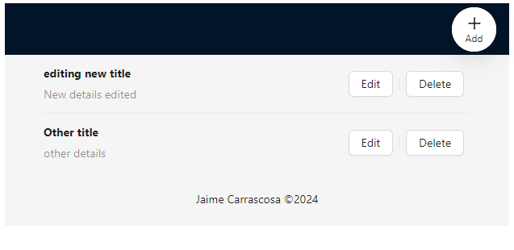
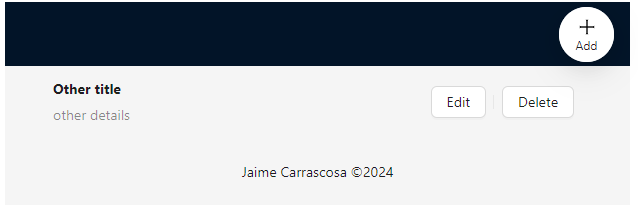

# PrimeIT frontend TO-DO list

### Author: Jaime Carrascosa Fernández

<inf.jaime1@gmail.com>

## Requirements

- Installed and running backend for the calls. Use the `.env` file for connection configuration.
- Node.js installed on version `20.10.0`. Recommended usage of nvm <https://github.com/coreybutler/nvm-windows> in windows or <https://github.com/nvm-sh/nvm> on unix/macOS systems.
- Port `3000` available. Or set another on both frontend and backend `.env` files.

## Install

    $ git clone https://github.com/JaimeCarrascosaF/primeITfrontend
    $ cd primeITfrontend
    $ npm install

## Running the project

    $ npm run start

## Testing the project

    $ npm run test

## Screenshots

